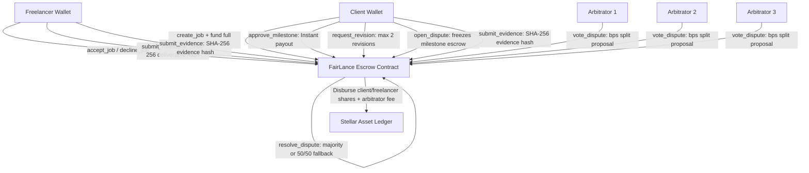
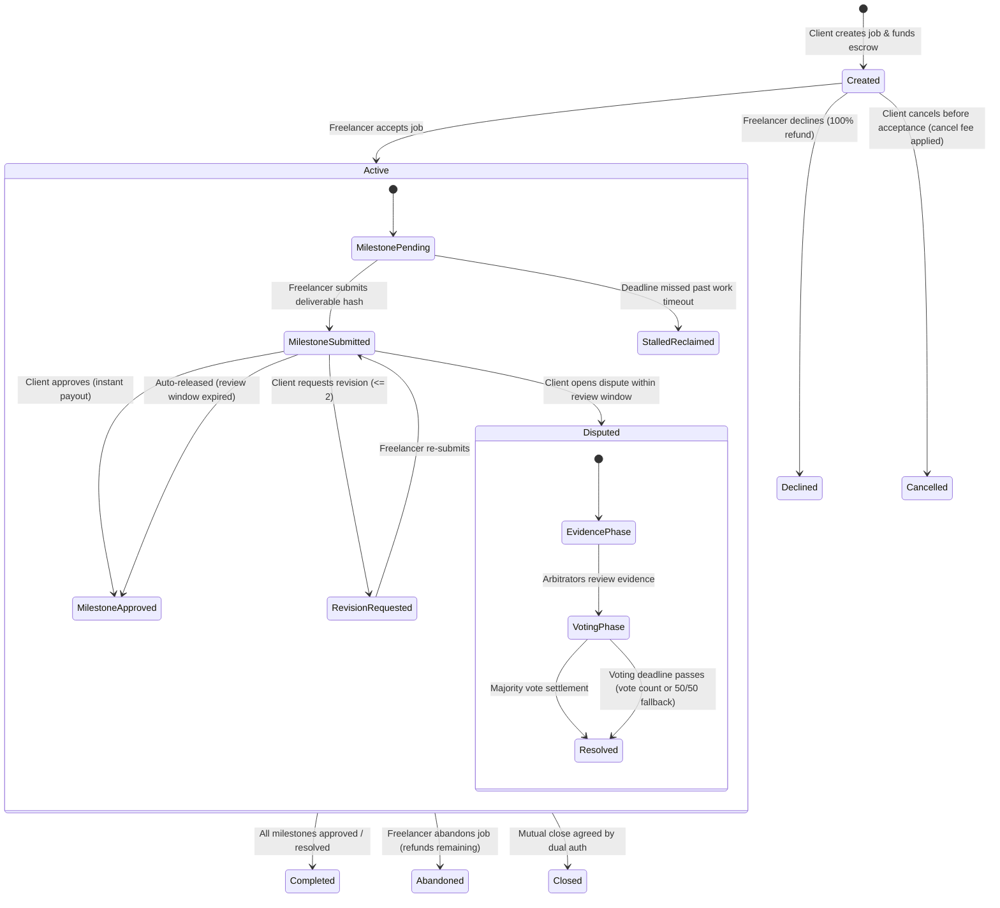

# Gig-escrow-contracts (Escrow-FairLance)

[](https://github.com/Escrow-FairLance/Gig-escrow-contracts/actions/workflows/ci.yml)
[](https://stellar.org/soroban)
[](LICENSE)

Decentralized freelancer escrow smart contract system built on Stellar Soroban with milestone-based disbursements, odd-sized panel dispute arbitration (1–7 panelists), economic staking, slashed penalties, and cryptographically anchored deliverable commitments.

---

## 🏛️ System Architecture



---

## 🔄 Escrow & Milestone State Machine



---

## 🛡️ Threat Model & Security Mitigations

| Threat Vector | Attack Scenario | Contract Mitigation |
| :--- | :--- | :--- |
| **Colluding Arbitrators** | Malicious arbitrators collude with a party to award unfair payout. | Arbitrators must stake tokens (`stake_arbitrator`) before panel selection. Panels must be odd-sized (1–7) with unique addresses. Admin/DAO can slash stake (`slash_arbitrator`) for provable collusion. |
| **Fake Deliverables** | Freelancer submits empty or corrupted files to trigger payout. | Deliverables are cryptographically anchored as SHA-256 hashes (`submit_milestone`). Client reviews during review window; disputed files are submitted as evidence for panel audit. |
| **Client Silent Griefing** | Client disappears without reviewing valid submitted work. | Guaranteed time-decay auto-release (`auto_release`) triggers immediate payout after `review_window_seconds` expires. |
| **Freelancer Ghosting** | Freelancer accepts job but never delivers work. | Client can reclaim remaining escrow (`reclaim_stalled`) once `milestone.deadline + work_timeout_seconds` passes. |
| **Revision Extortion** | Client endlessly demands revisions to avoid payment. | Hard contract cap of maximum 2 revisions per milestone (`MaxRevisionsExceeded`). On 3rd dissatisfaction, client must either approve or open an official dispute. |
| **Bribed / Non-Voting Arbitrators** | Arbitrators accept assignment but abandon dispute voting. | Non-voting arbitrators forfeit all fees (`arbitrator_fee_bps` split only among voters) and are slashed for non-voting negligence. |
| **Evidence Leakage** | Confidential deliverables exposed publicly on-chain. | Only 32-byte cryptographic SHA-256 hashes are stored on-chain. Deliverable files and evidence bundles remain off-chain, encrypted at rest. |
| **Escrow Accounting Deficits** | Re-entrancy, rounding errors, or mismatched balance math. | Strict invariant enforced: `job.escrow_balance == sum(unresolved milestones)`. All state changes precede token transfers. Integer division residues are refunded to the client. |

---

## 📦 Testnet Deployment Details

The contract is compiled for `wasm32v1-none` and verified on Stellar Testnet:

- **Network Passphrase**: `Test SDF Network ; September 2015`
- **Soroban RPC URL**: `https://soroban-testnet.stellar.org`
- **Contract ID**: `CCFJLJRJWMA6EG3N3X3EK7UN3OPKN3YKOAR4T53KSXOSRDJWT473HMAY`
- **Native XLM Contract**: `CDLZFC3SYJYDZT7K67VZ75HPJVIEUVNIXF47ZG2FB2RMQQVU2HHGCYSC`
- **Deployer / Admin**: `GB6CML3GZYGJ4BLR2PK5QTKQIF6KTT56ZXXTIHXTWG4JAPB3RKDVQTU4`

---

## 🚀 Building & Testing

### Prerequisites
- Rust `1.80+` with target `wasm32v1-none` (or `wasm32-unknown-unknown`)
- `stellar-cli` `22.0+`
- Node.js `20+`

### 1. Run Smart Contract Test Suite
```bash
cargo test
```
*Executes all 14 unit, property, and invariant tests verifying state transitions, revision limits, dual auth, and panel resolution.*

### 2. Build WebAssembly Contract
```bash
stellar contract build
# Or directly with cargo:
cargo rustc --manifest-path=Cargo.toml --crate-type=cdylib --target=wasm32v1-none --release
```

### 3. Deploy to Testnet
```bash
stellar keys generate deployer --network testnet --fund
stellar contract deploy \
  --wasm target/wasm32v1-none/release/Gig-escrow-contracts.wasm \
  --source deployer --network testnet --alias fairlance
```

### 4. Build TypeScript SDK Bindings
```bash
cd bindings
npm install
npm run build
```

### 5. Run End-to-End Testnet Lifecycle
```bash
npm install
npx ts-node --esm scripts/e2e_testnet.ts
```

---

## 📜 Contract Methods Reference

### Core Lifecycle
- `initialize(admin: Address)`: Set protocol administrator.
- `create_job(client, freelancer, token, milestones, terms, arbitrator_panel)`: Deposit milestone total into escrow.
- `accept_job(job_id)`: Freelancer commits to terms and milestones.
- `decline_job(job_id)`: Freelancer declines; 100% refund to client.
- `cancel_unaccepted(job_id)`: Client cancels before acceptance (applies cancellation fee if set).
- `submit_milestone(job_id, milestone_index, deliverable_hash)`: Anchors file SHA-256.
- `approve_milestone(job_id, milestone_index)`: Client releases milestone funds immediately.
- `request_revision(job_id, milestone_index, feedback_hash)`: Request milestone rework (max 2).
- `auto_release(job_id, milestone_index)`: Permissionless release upon review window expiry.
- `reclaim_stalled(job_id, milestone_index)`: Client reclaims escrow if work deadline + timeout passes.
- `abandon_job(job_id)`: Freelancer surrenders job; refunds remaining escrow.
- `mutual_close(job_id, client_amount, freelancer_amount)`: Dual-authenticated payout settlement.

### Arbitration & Staking
- `stake_arbitrator(arbitrator, token, amount)`: Collateral deposit to qualify for panels.
- `unstake_arbitrator(arbitrator, token, amount)`: Unstake tokens if no active panels remain.
- `slash_arbitrator(admin, arbitrator, token, amount, reason)`: Governance slash for rogue behavior.
- `open_dispute(job_id, milestone_index, caller, reason_hash)`: Freezes milestone in dispute.
- `submit_evidence(job_id, milestone_index, submitter, evidence_hash)`: Anchor audit proof.
- `vote_dispute(job_id, milestone_index, arbitrator, freelancer_share_bps)`: Panel vote in bps (0..10000).
- `resolve_dispute(job_id, milestone_index)`: Executes majority consensus or voting deadline fallback.

---

## 📄 License
MIT © Escrow-FairLance Team
